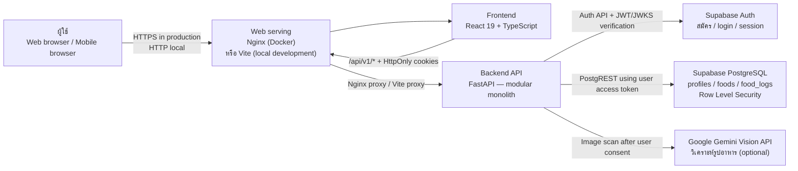
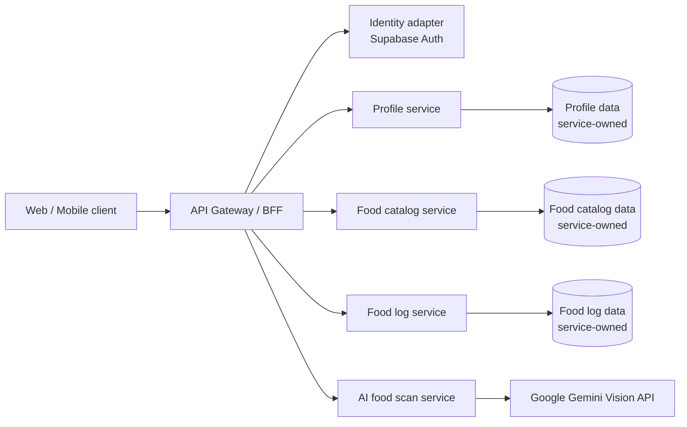
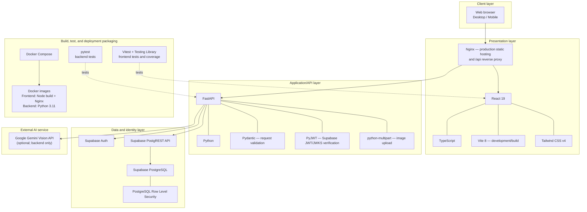

# NutriThai Architecture and Technology Stack

เอกสารสรุปสถาปัตยกรรมระบบและ technology stack สำหรับประกอบการนำเสนอโปรเจกต์

## 1. Architecture ปัจจุบัน

### ขอบเขตและสถานะของ architecture

- Diagram นี้แสดงระบบที่ใช้งานจริงในปัจจุบัน: frontend และ backend แยก container ได้ด้วย Docker Compose; Auth และฐานข้อมูลเป็น managed services ของ Supabase; Gemini เป็น external AI API
- Backend เป็น **modular monolith**: authentication, profile, food catalog, food logs และ AI scan เป็น modules/endpoints ภายใน FastAPI application และ deploy เป็น backend service เดียว
- ดังนั้นระบบปัจจุบันยัง **ไม่ใช่ microservices เต็มรูปแบบ** แม้จะแยก frontend/backend และใช้บริการภายนอกหลายตัว
- หากต้องปรับเป็น microservices จริงในอนาคต ต้องแยก bounded services ให้ deploy/scale/release ได้อิสระ กำหนด ownership ของข้อมูลและ service-to-service communication พร้อม monitoring/reliability เพิ่มเติม ไม่ควรอ้างว่าแต่ละ FastAPI route เป็น microservice

## 2. Proposed Microservices Architecture (Future Target)

แผนภาพนี้เป็น **ข้อเสนอสำหรับการแยกบริการในอนาคต ไม่ใช่ระบบที่ deploy อยู่ในปัจจุบัน** ใช้ประกอบการอธิบายขอบเขตบริการที่แยกจาก FastAPI modular monolith:

การแยกตามภาพนี้ต้องมีการ deploy และ release แต่ละ service อย่างอิสระ พร้อมกำหนด data ownership, service authentication, timeout/retry, observability และ failure handling ก่อนเรียกว่า microservices architecture ที่ใช้งานจริง

## 3. Technology Stack Diagram

## 4. Runtime flows

1. Browser โหลด React application จาก Nginx (Docker) หรือ Vite (local development).
2. Frontend เรียก FastAPI ผ่าน `/api/v1/*`; browser ส่ง session cookie แบบ HttpOnly โดยอัตโนมัติ
3. FastAPI ใช้ Supabase Auth สำหรับ authentication และส่งคำขอข้อมูลโดยใช้ access token ของผู้ใช้ เพื่อให้ PostgreSQL RLS จำกัดข้อมูลตามบัญชี
4. การค้นหารายการอาหารส่งคำค้นผ่าน backend API ไปยัง Supabase RPC และใช้ trigram indexes เมื่อ apply migration แล้ว; ไม่มี local CSV catalog fallback ใน frontend
5. การสแกนรูปส่งจาก backend ไป Gemini เมื่อผู้ใช้ยินยอม และต้องมี `GEMINI_API_KEY` ใน backend environment

## 5. Self-assessment

**ประเมินความคืบหน้าโปรเจกต์โดยรวม: 88% จาก 100%**

เป็นการประเมินตนเองตามขอบเขต roadmap ปัจจุบัน ไม่ใช่ผลตรวจรับจากผู้ใช้หรือ production sign-off:

| ด้านงาน | น้ำหนัก | ประเมินแล้ว | เหตุผล |
|---|---:|---:|---|
| Frontend, UX และ nutrition flows | 15% | 15% | หน้าหลัก บันทึกอาหาร ประวัติ Insights, Auth และ onboarding เชื่อม flow หลักแล้ว |
| Backend API และ input validation | 15% | 15% | FastAPI endpoints และ validation หลักมีแล้ว |
| Supabase Auth, PostgreSQL และ RLS | 20% | 20% | schema, RLS และการอ่าน/เขียนข้อมูลผ่าน backend เชื่อมกับ project ได้ |
| CRUD และการเชื่อมข้อมูล | 15% | 15% | profile และ food logs เชื่อม API; food catalog โหลดผ่าน API |
| Tests และ coverage | 15% | 15% | frontend tests และ coverage ผ่าน thresholds ที่ตั้งไว้; backend มีชุดทดสอบ |
| Security และ reliability | 10% | 8% | มี HttpOnly cookies, JWT checks, RLS, origin checks, consent และ rate limits; ยังควรยืนยันค่าจริงและเพิ่ม monitoring/distributed rate limiting ก่อน scale |
| Deployment และ production readiness | 10% | 0% | Docker Compose build/run ผ่านในเครื่อง แต่ยังไม่ได้ deploy และตรวจสอบบน cloud/โดเมน production |
| **รวม** | **100%** | **88%** | งานพัฒนาและ local integration ส่วนใหญ่เสร็จ; งาน cloud deployment/production verification ยังเหลือ |

> การประเมินนี้ถือว่า deployment บน cloud และการตรวจรับใน production เป็น deliverable ที่ยังไม่เสร็จ แม้ local Docker Compose จะ build และรันได้แล้ว

## 6. สิ่งที่ยังต้องทำ

- Deploy frontend/backend ไปยัง hosting และผูก production domain พร้อม HTTPS
- ตั้ง production environment variables, allowed origins และ secure cookies ให้ตรงกับโดเมนจริง
- ทดสอบ signup, email verification, login/session refresh, password recovery, CRUD และ AI scan กับ production configuration
- เตรียม monitoring, backup/restore และ distributed rate limiting ก่อนรองรับหลาย backend instances
