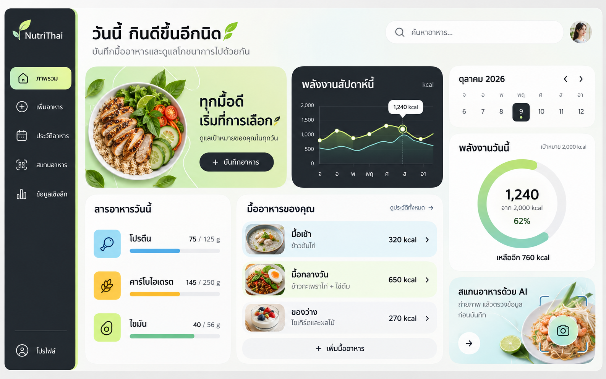

# แนวทางออกแบบ Frontend ของ NutriThai

ผู้ใช้ให้เก็บภาพนี้เป็นคอนเซปต์สำหรับพัฒนา frontend ในอนาคต เมื่อ 9 ตุลาคม 2026

## แนวทางภาพ

- พื้นหลังขาวนวล โทนเขียวมิ้นต์–ไลม์ และสีฟ้าอ่อน
- แถบเมนูด้านซ้ายสีเข้ม พร้อมสถานะเมนูที่เลือกสีเขียวอ่อน
- การ์ดมุมโค้ง ระยะห่างโปร่ง และตัวอักษรภาษาไทยอ่านง่าย
- Dashboard แสดงพลังงาน สารอาหาร มื้ออาหาร กราฟรายสัปดาห์ และทางเข้าสแกนอาหารด้วย AI
- ใช้ภาพอาหารประกอบเพื่อสร้างบรรยากาศและช่วยแยกรายการ

## ขอบเขตการนำไปใช้

ภาพนี้เป็นแนวทางดีไซน์ที่ผู้ใช้ขอเก็บอ้างอิง ยังไม่ได้อนุมัติให้ปรับโค้ด frontend ตามภาพ ตัวเลข อาหาร กราฟ และวันที่ในภาพเป็นข้อมูลประกอบคอนเซปต์ ต้องใช้ข้อมูลจริงและตรวจความสอดคล้องเมื่อพัฒนา รวมถึงออกแบบการจัดวางสำหรับมือถือเพิ่มเติม

## ที่มา

สร้างด้วยเครื่องมือ ImageGen แบบ built-in โดยอ้างอิงภาพ dashboard ที่ผู้ใช้แนบในบทสนทนา คงไฟล์ต้นฉบับที่สร้างไว้และคัดลอกภาพมาเก็บในโปรเจกต์

สรุป prompt ที่ใช้: สร้างภาพ UI mockup ของ NutriThai แบบ desktop โดยอ้างอิงพื้นขาวนวล แถบเมนู charcoal การ์ดโค้งขนาดใหญ่ โทน mint/lime/aqua และระยะห่างโปร่งจากภาพต้นแบบ ปรับข้อความเป็นภาษาไทย พร้อมฟีเจอร์บันทึกอาหาร สรุปโภชนาการ กราฟรายสัปดาห์ และสแกนอาหาร AI
